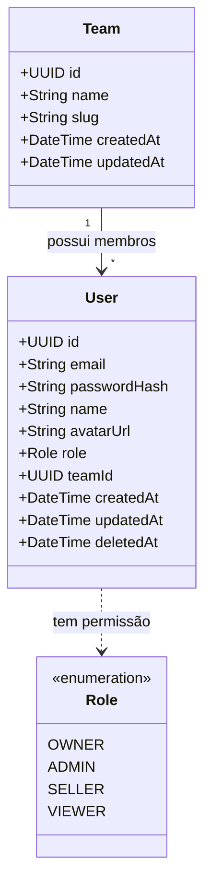

# 🏗️ Diagrama de Classes - Core Domain

Este diagrama representa a estrutura central de identidade e acesso do Orbit CRM.

```mermaid
classDiagram
    %% As classes serão desenhadas aqui
    class Role {
        <<enumeration>>
        OWNER
        ADMIN
        SELLER
        VIEWER
    }

    class Team {
        +UUID id
        +String name
        +String slug
        +DateTime createdAt
        +DateTime updatedAt
    }

    class User {
        +UUID id
        +String email
        +String passwordHash
        +String name
        +String avatarUrl
        +Role role
        +UUID teamId
        +DateTime createdAt
        +DateTime updatedAt
        +DateTime deletedAt
    }
    Team "1" --> "*" User : possui membros
    User ..> Role : tem permissão
```
