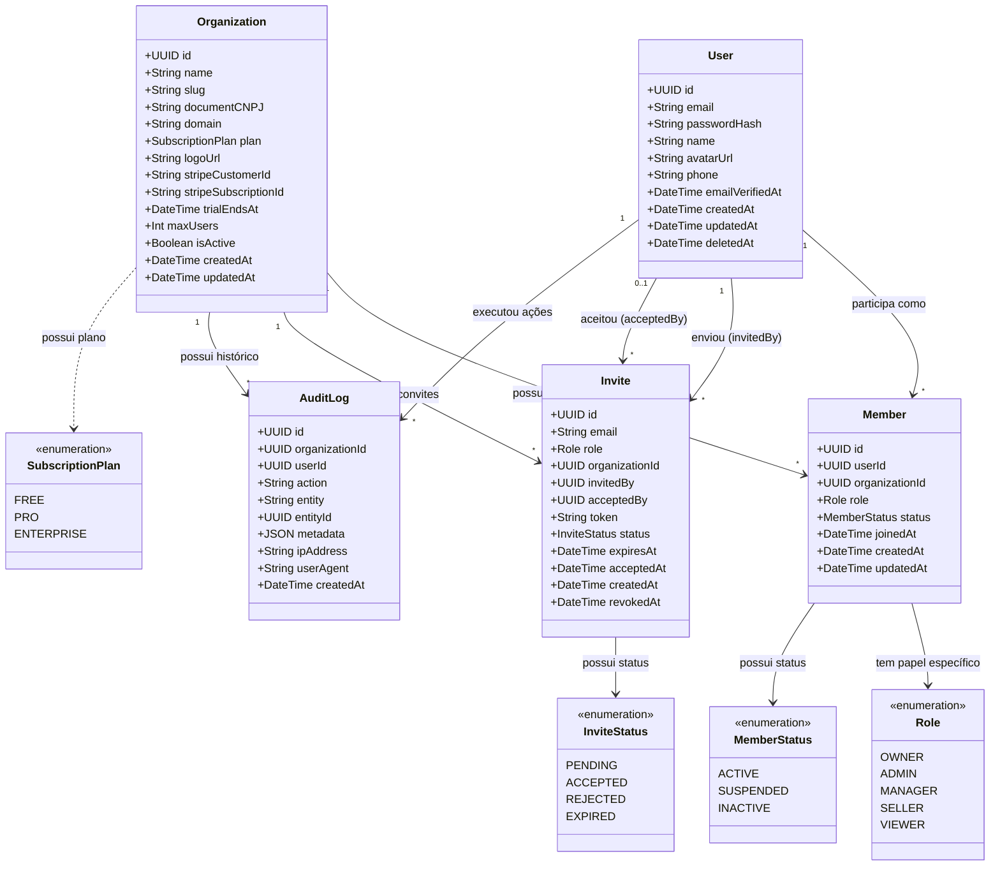

# 🏗️ Diagrama de Classes - Core Domain (SaaS Architecture)

Este diagrama representa a estrutura Multi-tenant N:N do Orbit CRM, permitindo que um usuário pertença a múltiplas organizações com papéis diferentes.

