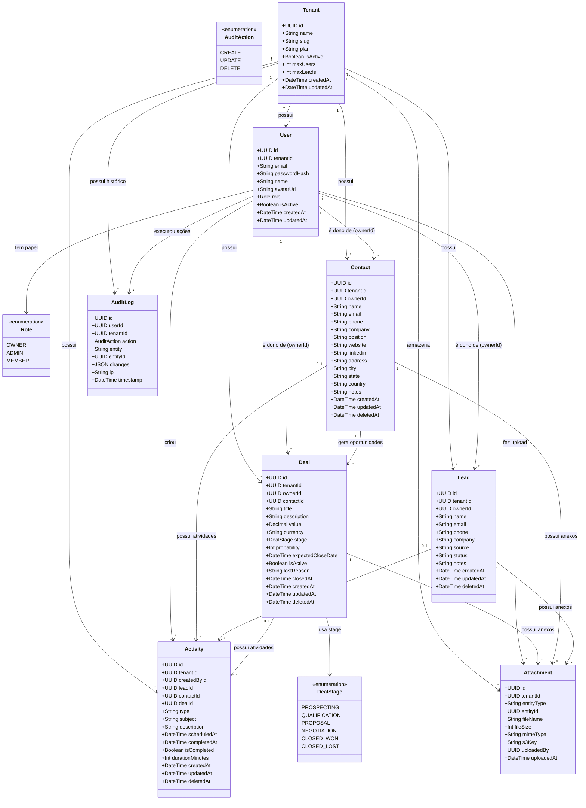

# 🏗️ Diagrama de Classes - Core Domain (SaaS Architecture)

Este diagrama representa a estrutura Multi-tenant do Orbit CRM com entidades de CRM, auditoria e controle de acesso.

```mermaid
classDiagram
    %% ENUMS
    class Role {
        <<enumeration>>
        OWNER
        ADMIN
        MEMBER
    }

    class AuditAction {
        <<enumeration>>
        CREATE
        UPDATE
        DELETE
    }

    class DealStage {
        <<enumeration>>
        PROSPECTING
        QUALIFICATION
        PROPOSAL
        NEGOTIATION
        CLOSED_WON
        CLOSED_LOST
    }

    %% CORE ENTITIES

    class Tenant {
        +UUID id
        +String name
        +String slug
        +String plan
        +Boolean isActive
        +Int maxUsers
        +Int maxLeads
        +DateTime createdAt
        +DateTime updatedAt
    }
    %% Organização/empresa no sistema SaaS

    class User {
        +UUID id
        +UUID tenantId
        +String email
        +String passwordHash
        +String name
        +String avatarUrl
        +Role role
        +Boolean isActive
        +DateTime createdAt
        +DateTime updatedAt
    }
    %% Usuário que acessa o sistema

    class Contact {
        +UUID id
        +UUID tenantId
        +UUID ownerId
        +String name
        +String email
        +String phone
        +String company
        +String position
        +String website
        +String linkedin
        +String address
        +String city
        +String state
        +String country
        +String notes
        +DateTime createdAt
        +DateTime updatedAt
        +DateTime deletedAt
    }
    %% Contato qualificado (ex-Lead convertido)

    class Lead {
        +UUID id
        +UUID tenantId
        +UUID ownerId
        +String name
        +String email
        +String phone
        +String company
        +String source
        +String status
        +String notes
        +DateTime createdAt
        +DateTime updatedAt
        +DateTime deletedAt
    }
    %% Prospect não qualificado

    class Deal {
        +UUID id
        +UUID tenantId
        +UUID ownerId
        +UUID contactId
        +String title
        +String description
        +Decimal value
        +String currency
        +DealStage stage
        +Int probability
        +DateTime expectedCloseDate
        +Boolean isActive
        +String lostReason
        +DateTime closedAt
        +DateTime createdAt
        +DateTime updatedAt
        +DateTime deletedAt
    }
    %% Oportunidade de venda com valor monetário

    class Activity {
        +UUID id
        +UUID tenantId
        +UUID createdById
        +UUID leadId
        +UUID contactId
        +UUID dealId
        +String type
        +String subject
        +String description
        +DateTime scheduledAt
        +DateTime completedAt
        +Boolean isCompleted
        +Int durationMinutes
        +DateTime createdAt
        +DateTime updatedAt
        +DateTime deletedAt
    }
    %% Interações polimórficas (call, email, meeting, task, note)

    class AuditLog {
        +UUID id
        +UUID userId
        +UUID tenantId
        +AuditAction action
        +String entity
        +UUID entityId
        +JSON changes
        +String ip
        +DateTime timestamp
    }
    %% Rastreabilidade de segurança (imutável)

    class Attachment {
        +UUID id
        +UUID tenantId
        +String entityType
        +UUID entityId
        +String fileName
        +Int fileSize
        +String mimeType
        +String s3Key
        +UUID uploadedBy
        +DateTime uploadedAt
    }
    %% Anexos polimórficos (Deal, Contact, Lead)

    %% RELACIONAMENTOS
    Tenant "1" --> "*" User : possui
    Tenant "1" --> "*" Contact : possui
    Tenant "1" --> "*" Lead : possui
    Tenant "1" --> "*" Deal : possui
    Tenant "1" --> "*" Activity : possui
    Tenant "1" --> "*" AuditLog : possui histórico

    User --> Role : tem papel
    User "1" --> "*" Contact : é dono de (ownerId)
    User "1" --> "*" Lead : é dono de (ownerId)
    User "1" --> "*" Deal : é dono de (ownerId)
    User "1" --> "*" Activity : criou
    User "1" --> "*" AuditLog : executou ações

    Contact "1" --> "*" Deal : gera oportunidades
    Contact "0..1" --> "*" Activity : possui atividades
    Lead "0..1" --> "*" Activity : possui atividades
    Deal "0..1" --> "*" Activity : possui atividades

    Deal --> DealStage : usa stage
    Tenant "1" --> "*" Attachment : armazena
    User "1" --> "*" Attachment : fez upload
    Deal "1" --> "*" Attachment : possui anexos
    Contact "1" --> "*" Attachment : possui anexos
    Lead "1" --> "*" Attachment : possui anexos
```
