# 🏗️ Diagrama de Classes - Core Domain (SaaS Architecture)

Este diagrama representa a estrutura Multi-tenant N:N do Orbit CRM, permitindo que um usuário pertença a múltiplas organizações com papéis diferentes.

```mermaid
classDiagram
    %% ENUMS
    class Role {
        <<enumeration>>
        OWNER
        ADMIN
        MANAGER
        SELLER
        VIEWER
    }

    class SubscriptionPlan {
        <<enumeration>>
        FREE
        PRO
        ENTERPRISE
    }

    class InviteStatus {
        <<enumeration>>
        PENDING
        ACCEPTED
        REJECTED
        EXPIRED
    }

    class MemberStatus {
        <<enumeration>>
        ACTIVE
        SUSPENDED
        INACTIVE
    }

    %% CORE ENTITIES

    class User {
        +UUID id
        +String email
        +String passwordHash
        +String name
        +String avatarUrl
        +String phone
        +DateTime emailVerifiedAt
        +DateTime createdAt
        +DateTime updatedAt
        +DateTime deletedAt
    }
    %% Identidade global do usuário (Login)

    class Organization {
        +UUID id
        +String name
        +String slug
        +String documentCNPJ
        +String domain
        +SubscriptionPlan plan
        +String logoUrl
        +String stripeCustomerId
        +String stripeSubscriptionId
        +DateTime trialEndsAt
        +Int maxUsers
        +Boolean isActive
        +DateTime createdAt
        +DateTime updatedAt
    }
    %% O Tenant (Conta Pagante)

    class Member {
        +UUID id
        +UUID userId
        +UUID organizationId
        +Role role
        +MemberStatus status
        +DateTime joinedAt
        +DateTime createdAt
        +DateTime updatedAt
    }
    %% Tabela Pivô (Vínculo User <-> Organization)

    class Invite {
        +UUID id
        +String email
        +Role role
        +UUID organizationId
        +UUID invitedBy
        +UUID acceptedBy
        +String token
        +InviteStatus status
        +DateTime expiresAt
        +DateTime acceptedAt
        +DateTime createdAt
        +DateTime revokedAt
    }
    %% Convites pendentes

    class AuditLog {
        +UUID id
        +UUID organizationId
        +UUID userId
        +String action
        +String entity
        +UUID entityId
        +JSON metadata
        +String ipAddress
        +String userAgent
        +DateTime createdAt
    }
    %% Rastreabilidade de segurança

    %% RELACIONAMENTOS
    User "1" --> "*" Member : participa como
    Organization "1" --> "*" Member : possui membros
    Member --> Role : tem papel específico
    Member --> MemberStatus : possui status

    Organization "1" --> "*" Invite : gera convites
    User "1" --> "*" Invite : enviou (invitedBy)
    User "0..1" --> "*" Invite : aceitou (acceptedBy)
    Invite --> InviteStatus : possui status

    Organization "1" --> "*" AuditLog : possui histórico
    User "1" --> "*" AuditLog : executou ações

    Organization ..> SubscriptionPlan : possui plano
```

